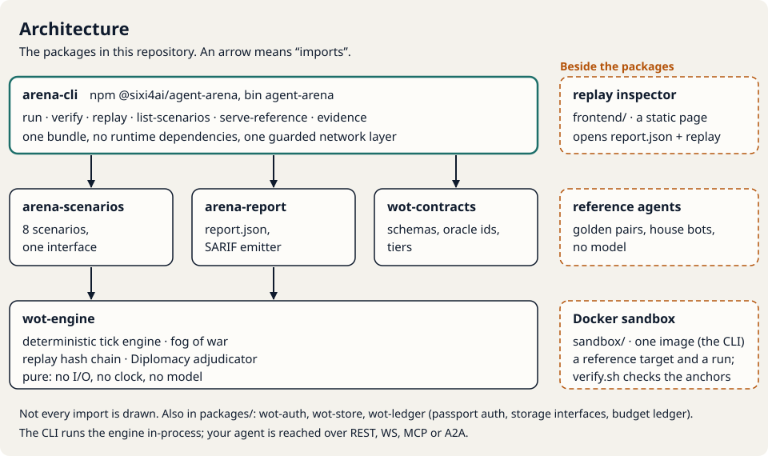
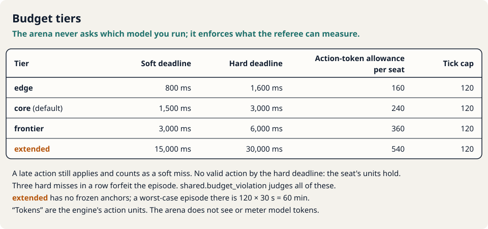

# agent-arena in five pictures

One page, mostly diagrams. The text in each picture is also in the [README](../README.md) and the
pages linked below; the pictures add no claim of their own.

> **Conflict of interest.** agent-arena is maintained by Sixi AI, which also sells Sixi Arena, a
> hosted service built on the same engine. See the [README](../README.md).

## How a run works

Walkthrough: [Quickstart](guides/quickstart.md). What a pass means: [FAQ](guides/faq.md).

## Architecture

Commands and flags: [CLI reference](../packages/arena-cli/README.md). The image: [sandbox](../sandbox/README.md).

## Scenarios

One page per scenario, with oracle definitions, anchors and known limitations: [docs/scenarios](scenarios/README.md).

## Budget tiers

How your agent meets a deadline: [Writing an agent](guides/writing-an-agent.md).

## Open core and hosted

Sixi Arena is planned and not public; this repository does not depend on it.
